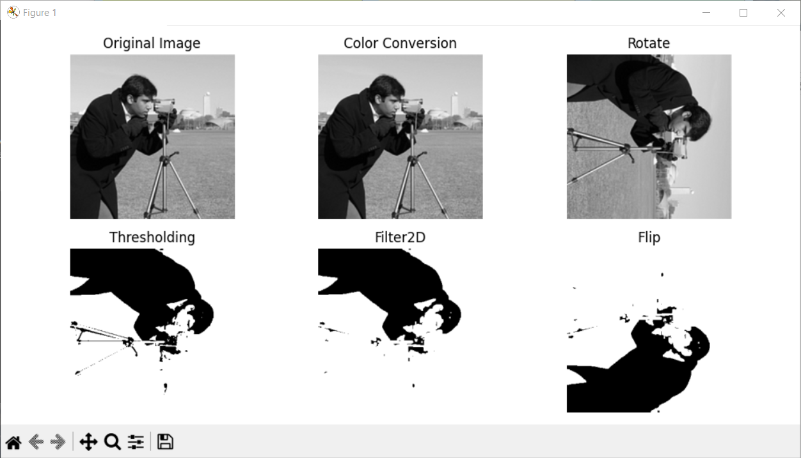
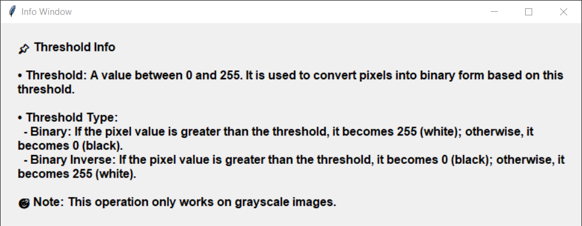

# 🧠 InfinityProcess: Computer Vision GUI

**InfinityProcess_Computer_Vision** is a Python application that offers a user-friendly graphical interface (GUI) for various computer vision tasks. It simplifies image processing workflows with a rich set of tools and operations.

---

## ✨ Features

- **🖼️ Image Loading and Display**
  - Load images from the local file system
  - View image properties

- **🛠️ Basic Image Operations**
  - Resize Image
  - Rotate Image
  - Flip Image (horizontal, vertical)

- **🎛️ Filtering Operations**
  - Gaussian Blur
  - Median Blur
  - Bilateral Filter
  - 2D Gabor Filter

- **🧩 Edge and Corner Detection**
  - Canny Edge Detection
  - Harris Corner Detection
  - Shi-Tomasi Corner Detection

- **🎚️ Thresholding Techniques**
  - Thresholding
  - Adaptive Thresholding
  - Otsu Thresholding
  - Gamma Transform

- **🔍 Contour Operations**
  - Find Contours
  - Draw Contours

- **📊 Histogram Operations**
  - Draw Histogram
  - Equalize Histogram
  - CLAHE (Contrast Limited Adaptive Histogram Equalization)

- **📈 Fourier Transformations**
  - DFT (Discrete Fourier Transform)
  - IDFT (Inverse DFT)
  - FFT (Fast Fourier Transform)

---

## 🖼️ Application Screenshots

### 📌 Main Interface - `Main_GUI`


This is where the magic begins! A clean and intuitive main window welcomes you to load images, apply operations, and kick off your vision workflows. Select, apply — it's all at your fingertips.

---

### 🧪 Results Panel - `Results`



Here's where all the magic shows itself! This panel displays the output of each operation you've applied — step by step. Whether it’s a filter, a transformation, or an edge detector, you’ll see exactly what changed and where.

---

### 📂Prepare Dataset - `Dataset Preparation Settings`


Turn your image dataset folders into a playground! With just a few clicks, you can batch-process your pictures and get them ready for your next big project — fast, easy, and fun!

---

### 💡 Info Window - `Info_Window`



Curious minds click — and the Info Window appears!  
This smart little popup gives you a quick rundown of what each process does. Not sure what that Gabor filter is for? Forget what Gamma Transform does? Don’t worry — **Info Window** has your back. Think of it as a mini encyclopedia — but way more fun! 😄

---

### 🛠️ Settings Menu - `Settings_Menu`


 
This is your control room!  
Think of it as your secret lab — this is where you fine-tune the app’s behavior. Need to switch the language? Adjust startup preferences? It’s all here. Simple yet powerful! Tweak a few things and suddenly you’re in full-on Matrix mode. 😎 Oh, and don’t worry — your genius tweaks are saved, like digital breadcrumbs leading back to your personal utopia. 🧠💾

---

## 🧩 Requirements

- Python **3.10** or higher  
  ✅ Tested on Python **3.12.10**

---

## 🛠️ Installation

### 🔧 Manual Installation

```bash
# 1. Clone the repository
git clone https://github.com/username/InfinityProcess_Computer_Vision.git

# 2. Navigate into the directory
cd InfinityProcess_Computer_Vision

# 3. Install dependencies
pip install -r requirements.txt

# 4. Run the application
python main.py
```
### 📦 Using the Pre-built Version

1. Download InfinityProcess.zip from the Releases section.
2. Extract the folder.
3. Run InfinityProcess.exe to start using it immediately — no installation needed!

## 📊 Usage

- **Load Image**: Click the **Load Image** button to select an image.
- **Add Process**: Click the **Create New Process** button to add a process frame and choose a process.
- **Apply Processes**: Click the **Apply** button to apply selected operations.
- **View Results**: View all image transformations step-by-step within the GUI.

## 📋 License
- This project is licensed under the Apache License 2.0.
